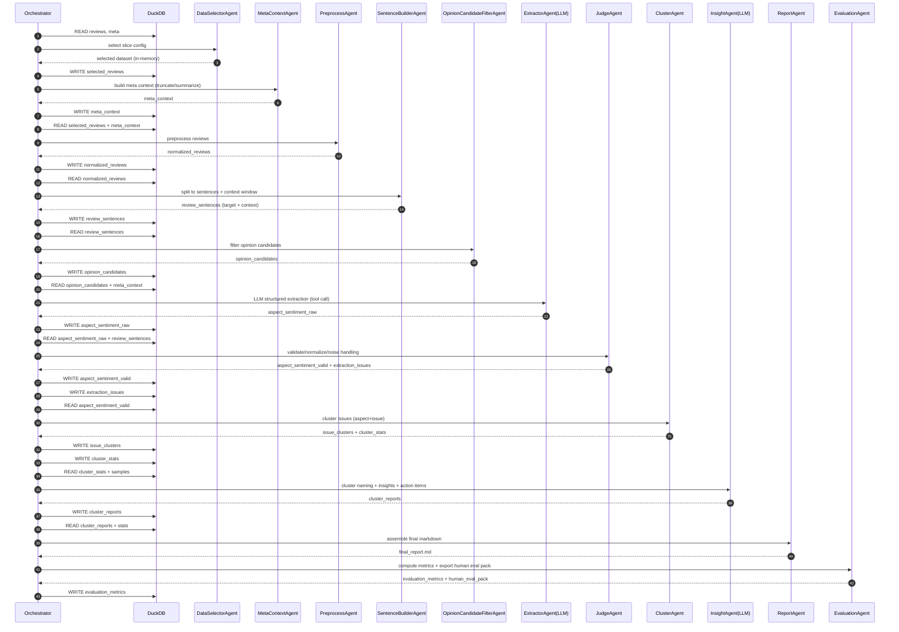

# 课设设计文档（改进版）：基于电商评论的方面级情感分析、需求聚类与多 Agent 自动洞察

**技术栈：LangChain + DuckDB + LLM（结构化抽取/洞察生成） + 聚类模型（TF‑IDF/Embedding + KMeans/HDBSCAN）**
**文档版本：v1.1（已吸收评审意见）**

---

## 0. 文档目的与阅读前提

### 0.1 文档目的

本文档面向“不了解项目上下文的读者”，完整说明如何基于 DuckDB 中的两张数据表（`reviews` 与 `meta`）实现一个可复现的数据挖掘课设系统，用于：

* 从海量评论中抽取**方面（aspect）**与**方面级情感（aspect sentiment）**
* 聚类得到**痛点/需求簇（issue clusters）**
* 自动生成**可执行建议（action items）**与**证据（evidence）**
* 通过 **LangChain 多 Agent**实现流程化、可治理、可追踪

### 0.2 前提条件（必须满足）

* 已存在 DuckDB 数据库，并包含 `reviews`、`meta` 两张表（字段见第 2 节）
* 两表可通过 `parent_asin` 关联
* 运行环境具备：

  * Python 数据处理能力（用于清洗、聚类、评估）
  * LangChain（用于 Agent 架构与工具封装）
  * 可用 LLM（API 或本地均可；需支持结构化输出，最好支持 Function Calling/Tool Call）
  * 可用 Embedding 方案（可选但推荐；TF‑IDF可作为 baseline）

### 0.3 范围约束（工期 10 天可落地）

* 建议从**单一类目（main_category）**或**单一 parent_asin**切入
* 初次跑通建议控制：

  * 评论数：5,000–20,000（先跑通再扩）
  * 句子数：经筛选后送入 LLM 的候选句子数建议 **≤ 20,000**（详见第 8 节成本控制）

---

## 1. 项目目标与最终产出

### 1.1 输入

* DuckDB 表 `reviews`：用户评论（评分、标题、正文、是否验证购买、时间等）
* DuckDB 表 `meta`：商品元数据（类目、标题、features、description、details 等）

### 1.2 输出（对外可交付）

1. **痛点地图（Pain Point Map）**

   * 每个痛点簇：簇名、规模、负面率、趋势、代表证据句、可执行建议、优先级
2. **结构化事实表（可用于二次分析）**

   * 句子级/方面级：aspect、sentiment、issue、evidence、质量标记
3. **实验与评估结果**

   * baseline vs LLM增强 vs LLM+Judge增强 的消融对比
   * 自动指标（覆盖率、轮廓系数等）+ 人工抽样核验
4. **最终报告（Markdown）**

   * 方法、架构、实验、结果展示、失败分析、结论

---

## 2. 数据字典：DuckDB 现有数据表字段（自包含说明）

> 本节列出你当前已拥有的两张表及字段用途，保证新读者无需额外材料也能理解数据内容。

### 2.1 `reviews`（用户评论表）

| 字段                  | 类型    | 含义/说明                           | 本方案用途                |
| ------------------- | ----- | ------------------------------- | -------------------- |
| `rating`            | float | 用户评分（1.0–5.0）                   | 弱监督/一致性校验、优先级参考      |
| `title`             | str   | 评论标题                            | 与正文拼接增强语义密度          |
| `text`              | str   | 评论正文                            | 核心文本输入               |
| `images`            | str   | 用户上传图片URL列表（small/medium/large） | 可选：报告证据展示；非核心算法输入    |
| `asin`              | str   | 商品子ID                           | 可做变体分析               |
| `parent_asin`       | str   | 商品父ID（同款不同变体共享）                 | **核心 join 键**（连接元数据） |
| `user_id`           | str   | 用户ID                            | 可选：重复评论/用户偏差分析       |
| `timestamp`         | int   | Unix 时间戳                        | 趋势分析（痛点随时间变化）        |
| `verified_purchase` | bool  | 是否验证购买                          | 数据质量筛选条件             |
| `helpful_vote`      | int   | 有用票数                            | 代表样本挑选、证据句优先级        |

### 2.2 `meta`（商品元数据表）

| 字段                | 类型    | 含义/说明             | 本方案用途              |
| ----------------- | ----- | ----------------- | ------------------ |
| `main_category`   | str   | 商品主类目（域）          | 实验切片：选择一个类目        |
| `title`           | str   | 商品名称              | 作为 LLM 上下文约束（减少跑题） |
| `average_rating`  | float | 商品平均评分            | 产品背景统计             |
| `rating_number`   | int   | 商品评分数量            | 判断样本代表性            |
| `features`        | str   | 要点（bullet points） | 作为上下文（需摘要/截断，避免过长） |
| `description`     | str   | 商品描述              | 作为上下文（可摘要）         |
| `price`           | float | 价格                | 可选：与痛点相关性分析        |
| `images`          | str   | 商品图片              | 可选：报告展示            |
| `videos`          | str   | 商品视频              | 一般不用于核心算法          |
| `store`           | str   | 店铺                | 可选：店铺层对比           |
| `categories`      | str   | 层级类目              | 更细粒度切片             |
| `details`         | str   | 详细参数（材料、尺寸等）      | 作为上下文约束（可选摘要）      |
| `parent_asin`     | str   | 商品父ID             | **核心 join 键**      |
| `bought_together` | str   | 搭配购买信息            | 可选扩展方向             |

### 2.3 关键关系

* **连接键**：`reviews.parent_asin = meta.parent_asin`
* 文本输入主要来源：`reviews.title + reviews.text`
* 推荐分析粒度：**句子级**，但必须解决上下文丢失风险（见第 7 节）

---

## 3. 核心风险与改进策略（已纳入本方案）

### 3.1 风险 A：句子级处理导致“上下文丢失”（关键算法隐患）

**问题**：拆句后单句缺乏上下文会导致指代不明、转折丢失、情绪误判。
**方案（本设计已采纳）**：

* 在句子表中新增：

  * `target_sentence`（需要抽取的目标句）
  * `context_text`（上下文窗口：前一句 + 当前句 + 后一句，或更宽）
* LLM 抽取输入使用 `context_text`，但 Prompt/结构化约束必须强调：

  * **只针对 `target_sentence` 做抽取**
  * `context_text` 仅用于消解指代、理解转折与比较关系

> 进阶：可选做指代消解，但属于增强项，不作为 10 天必做内容。

### 3.2 风险 B：聚类对象过短导致跨方面混淆

**问题**：只对 issue 短语做向量化（如 “stopped working”）可能把不同组件的问题混到一起。
**方案（本设计已采纳）**：

* 聚类向量化使用拼接文本：
  **`cluster_key_text = aspect + " " + issue`**
  例如：`"battery drains fast"`、`"screen stopped working"`
* 同时保留“按 aspect 分桶聚类”的策略，以进一步减少跨维度混淆。

### 3.3 风险 C：LLM 调用量过大导致成本与耗时不可控

**问题**：30k 评论 × 平均 5 句 ≈ 150k 句，直接逐句抽取成本高。
**方案（本设计已采纳）**：

* 新增 **OpinionCandidateFilterAgent（前置过滤）**：
  通过启发式规则或廉价模型过滤掉“缺少观点/信息密度低”的句子，只将候选观点句送入 LLM。
* 强制“分批处理 + 缓存与断点续跑”：

  * 已处理 `sentence_id` 不重复调用
  * 失败样本单独队列重试

> 备选路径（可选扩展）：先做粗聚类再抽样送 LLM（“先聚类后抽取”）。本设计以“先抽取后聚类”为主，但通过前置过滤控制成本。

---

## 4. 总体架构（LangChain + DuckDB）：组件与职责

### 4.1 架构分层

* **数据层（DuckDB）**：原始表 + 中间表 + 结果表（作为稳定接口）
* **编排层（Orchestrator）**：统一调度 Agent，控制写入串行，保证 DuckDB 兼容性
* **Agent 层（LangChain Agents）**：模块化处理单元，职责单一、输入输出清晰
* **模型服务层**：

  * LLM：结构化抽取、复核、簇洞察生成
  * Embedding：语义向量（推荐）
* **治理与观测层**：日志、失败率、覆盖率、版本追踪

### 4.2 DuckDB 并发与连接管理（工程约束）

由于 DuckDB 在单文件模式下多进程并发写入存在风险，本架构采用：

* **单写者模式（Single Writer）**：
  每个 Agent 只负责**读→处理→返回结果**，由 **Orchestrator** 统一执行落库（串行写入）。
* 若必须并行：

  * 可并行“读取与计算”，但写入必须排队进入单一写入通道。

---

## 5. 数据流向时序图（Sequence Diagram）

> 该时序图明确“Agent 与 DuckDB 的读写交互”，满足评审建议中的“数据流向清晰化”。

---

## 6. Agent 划分与职责（清晰能力边界）

> 设计原则：每个 Agent 职责单一、输出结构化；由 Orchestrator 串行落库；便于断点续跑与审计。

### 6.1 Orchestrator（编排器，非业务 Agent）

**职责**

* 控制执行顺序与依赖关系
* 统一写入 DuckDB（单写者）
* 执行断点续跑与版本一致性检查
* 记录运行日志（处理量、失败率、耗时、重试次数）

**关键能力**

* “读 DB → 调用 Agent → 收集结果 → 写 DB”的闭环
* 失败样本队列管理（特别是 LLM 抽取失败与 JSON 解析失败）

---

### 6.2 DataSelectorAgent（数据切片与实验样本固定）

**职责**

* 从 `reviews` 与 `meta` 中选择研究范围（类目/商品/时间）
* 按 `parent_asin` join 元数据关键字段
* 固定实验样本集，确保可复现

**输入**

* DuckDB：`reviews`, `meta`
* 配置：`main_category` / `parent_asin` / 时间窗口 / 过滤条件（如 verified/helpful）

**输出（写入 DuckDB）**

* `selected_reviews`（固定样本）
* `selection_profile`（可选：样本量、评分分布、verified 占比等统计）

---

### 6.3 MetaContextAgent（元数据上下文构建：截断/摘要）

> 对应评审建议：`meta.features` 可能很长，需先处理以避免 Token 溢出与成本上升。

**职责**

* 为每个 `parent_asin` 构建“LLM 可用的最小上下文”
* 对 `features/description/details` 执行：

  * 截断（hard limit）或摘要（可选 LLM 摘要/规则摘要）
* 输出字段命名清晰，避免与 `reviews.title` 混淆

**输出（写入 DuckDB）**

* `meta_context`（建议字段）

  * `parent_asin`
  * `product_title`（来自 meta.title）
  * `main_category`
  * `features_short`（截断/摘要后的 features）
  * `description_short`（可选）
  * `details_short`（可选）
  * `context_version`（用于复现）

---

### 6.4 PreprocessAgent（评论级清洗与文本规范化）

**职责**

* 合并文本：`review_title + review_text`
* 去空/去短/去重复
* 规范化字符与空白
* 保留溯源字段用于回查

**输出**

* `normalized_reviews`

---

### 6.5 SentenceBuilderAgent（句子构建 + 上下文窗口）

> 对应评审建议：解决“上下文丢失”风险。

**职责**

* 将评论拆成句子，并为每个句子构建上下文窗口
* 输出目标句与上下文同时存在的结构

**输出（写入 DuckDB）**

* `review_sentences`（建议字段）

  * `sentence_id`（唯一）
  * `review_pk`（或可溯源到 reviews 的主键/组合键）
  * `parent_asin`, `timestamp`, `rating`, `verified_purchase`, `helpful_vote`
  * `target_sentence`（目标句）
  * `prev_sentence`（可选）
  * `next_sentence`（可选）
  * `context_text`（推荐：prev + target + next 拼接）
  * `sentence_index`（句子位置）
  * `review_text_full`（可选：全评论文本，必要时用于复核）

---

### 6.6 OpinionCandidateFilterAgent（观点候选句过滤：成本控制核心）

> 对应评审建议：在 SentenceBuilder 与 LLM 之间加前置过滤，显著降低 LLM 调用次数。

**职责**

* 过滤掉信息密度低/不含观点/纯客观的句子
* 仅保留“疑似含观点”的候选句进入 LLM 抽取

**输入**

* `review_sentences`

**输出**

* `opinion_candidates`（建议字段）

  * `sentence_id`
  * `is_candidate`（bool）
  * `filter_reason`（规则命中原因，用于解释与调参）
  * `priority_weight`（可选：用于决定先处理哪些句子）

**建议过滤策略（不涉及代码，但需可实现）**

* 规则特征示例：

  * 句长阈值（过短过滤）
  * 含评价形容词/副词的比例（英文可用词典；中文可用情感词典/词性）
  * 含否定词/程度词（not/never/very 等）
  * 含比较/转折信号（but/however/although 等）
  * 标点/感叹号（可能是主观表达）
* 可选廉价模型：

  * 轻量情感/主观性分类器（仅用于筛选，不追求极致准确）

---

### 6.7 AspectSentimentExtractorAgent（LLM 结构化抽取，强约束输出）

> 对应评审建议：JSON 输出稳定性与 Function Calling。

**职责**

* 输入：`context_text` + `target_sentence` +（可选）`meta_context`
* 输出：仅针对 `target_sentence` 的结构化抽取结果（方面、情感、issue、证据）

**关键要求（必须写进实现规范）**

* **输入规范**：

  * 提供 `context_text` 用于指代消解与转折理解
  * 明确 `target_sentence` 是唯一抽取对象
* **输出规范**（结构化 schema）：

  * `aspects[]` 列表，每项包含：

    * `aspect`（名词短语，组件/维度）
    * `sentiment`（positive/negative/neutral）
    * `sentiment_score`（可选）
    * `issue`（具体问题短语，尽量可聚类）
    * `evidence`（必须可在 target_sentence 中定位）
* **结构化输出机制优先级**：

  1. **Function Calling / Tool Call**（最稳健，几乎无需重试）
  2. LangChain 的 Pydantic/StructuredOutputParser（次优，需少量重试）
* **输出范围约束**：

  * 仅允许引用 `target_sentence` 的证据，不允许编造或引用未提供内容

**输出（写入 DuckDB）**

* `aspect_sentiment_raw`

  * `sentence_id`
  * `llm_output`（结构化对象或其序列化）
  * `model_name`, `prompt_version`
  * `parse_status`, `retry_count`, `error_type`

---

### 6.8 ExtractionJudgeAgent（抽取校验、归一、噪声类处理）

> 对应评审建议：增加“噪声类/泛化 issue”处理，避免垃圾簇。

**职责**

* 校验抽取结果结构与证据可定位性
* aspect 同义归一（taxonomy/同义词表）
* sentiment 与 rating 弱一致性冲突标记
* **噪声/无效类识别与剔除**

**噪声类规则（必须具备）**

* 若 `issue` 或 `aspect` 属于极泛化词且缺乏修饰语，标记为 `NOISE/INVALID`：

  * 示例：["product", "item", "it", "quality", "review"] 等
* 若 evidence 无法定位到 target_sentence：标记为 `INVALID`
* 若抽取为空或过度发散：标记为 `INVALID`

**输出（写入 DuckDB）**

* `aspect_sentiment_valid`（展开为一行一个 aspect）

  * `sentence_id`, `parent_asin`, `timestamp`, `rating`
  * `aspect_norm`, `sentiment`, `sentiment_score`
  * `issue_norm`, `evidence`
  * `validity_label`（VALID / NOISE / INVALID）
  * `quality_flags`（冲突/低置信/证据缺失…）
* `extraction_issues`（用于错误分析与复核队列）

---

### 6.9 IssueClusterAgent（聚类：aspect+issue 向量化 + 簇统计）

> 对应评审建议：使用“Aspect + Issue”拼接向量化，避免跨方面混淆。

**职责**

* 输入：仅使用 `validity_label = VALID` 的记录
* 构造聚类文本键：

  * `cluster_key_text = aspect_norm + " " + issue_norm`
* 可选：仍按 `aspect_norm` 分桶聚类（强烈推荐）
* 输出簇归属与簇统计指标

**输出（写入 DuckDB）**

* `issue_clusters`

  * `aspect_norm`, `cluster_id`
  * `sentence_id`, `cluster_key_text`, `issue_norm`, `sentiment`
  * `is_noise`（算法噪声点标记）
* `cluster_stats`

  * 每簇：`count`, `neg_ratio`, `recent_trend`, `top_terms`, `representative_samples`

---

### 6.10 ClusterInsightAgent（LLM：簇命名、摘要、建议、优先级）

**职责**

* 对每个簇生成“可读可执行”的洞察条目：

  * `cluster_name`（一句话命名）
  * `summary`（2–3 句现象描述）
  * `evidence_sentences`（3–5 条证据句，必须来自样本）
  * `action_items`（3 条可执行建议）
  * `priority`（高/中/低：基于规模×负面率×趋势，可再由 LLM解释）

**输入**

* `cluster_stats` + 代表样本（优先 helpful_vote 高/典型性强）
* 可选：meta_context（帮助建议更贴合产品特性）

**输出**

* `cluster_reports`

---

### 6.11 ReportAssemblerAgent（报告组装）

**职责**

* 输出专业 Markdown 报告：

  * 数据与前提条件
  * 方法与架构（含时序图）
  * 实验与评估
  * Top 痛点簇（表格化呈现）
  * 失败分析与改进方向

**输出**

* `final_report.md`

---

### 6.12 EvaluationAgent（自动指标 + 人工抽样包）

> 对应评审建议：增加自动化评估指标（轮廓系数、覆盖率等）。

**职责**

* 计算自动评估指标：

  * **Coverage Rate（覆盖率）**：被识别为观点候选/成功抽取/最终进入 VALID 的比例
  * **Silhouette Coefficient（轮廓系数）**：聚类质量（对可计算距离/embedding 的簇）
  * 可选：簇规模分布、噪声点比例、冲突率
* 生成人工评估抽样包（200句+簇抽样）

**输出**

* `evaluation_metrics`
* `human_eval_pack`（用于人工打分与记录）

---

## 7. 中间表设计（DuckDB）：为可复现与可审计而存

> 本节定义建议新增/落库的核心表，使系统可复现、易调试、可断点续跑。

### 7.1 必备中间表（推荐最小集合）

1. `selected_reviews`
2. `meta_context`
3. `review_sentences`（含 target_sentence + context_text）
4. `opinion_candidates`
5. `aspect_sentiment_raw`
6. `aspect_sentiment_valid`（含 validity_label）
7. `issue_clusters`
8. `cluster_stats`
9. `cluster_reports`
10. `evaluation_metrics`

---

## 8. 执行流程（可直接照此落地实施）

### 8.1 标准主流程（“先抽取后聚类”，已加过滤与上下文）

1. **DataSelectorAgent**

   * 选定类目或商品，join 元数据，落库 `selected_reviews`
2. **MetaContextAgent**

   * 对 features/description/details 截断或摘要，落库 `meta_context`
3. **PreprocessAgent**

   * 清洗并规范化文本，落库 `normalized_reviews`
4. **SentenceBuilderAgent**

   * 分句，并构建 `context_text`，落库 `review_sentences`
5. **OpinionCandidateFilterAgent**

   * 过滤候选观点句，落库 `opinion_candidates`
6. **AspectSentimentExtractorAgent（LLM）**

   * 以 `context_text` 输入但只抽取 `target_sentence`，落库 `aspect_sentiment_raw`
7. **ExtractionJudgeAgent**

   * 校验、归一、噪声剔除，落库 `aspect_sentiment_valid` + `extraction_issues`
8. **IssueClusterAgent**

   * 以 `aspect + issue` 作为向量化输入聚类，落库 `issue_clusters` + `cluster_stats`
9. **ClusterInsightAgent（LLM）**

   * 簇命名、摘要、建议，落库 `cluster_reports`
10. **ReportAssemblerAgent**

* 生成 `final_report.md`

11. **EvaluationAgent**

* 输出 `evaluation_metrics` 与人工抽样包

### 8.2 成本控制执行要点（必须遵守）

* **先过滤再抽取**：LLM 只处理 `opinion_candidates.is_candidate = true`
* **批处理**：按 parent_asin 或按批次处理，确保可中断可恢复
* **缓存**：同一 `sentence_id` 不重复抽取；失败进入重试队列

---

## 9. 评估方案（自动指标 + 人工评估 + 消融实验）

### 9.1 自动化指标（建议至少包含）

* **Coverage Rate（覆盖率）**

  * `candidate_coverage = 候选观点句数 / 总句子数`
  * `extraction_success = LLM结构化成功数 / 候选观点句数`
  * `valid_rate = VALID记录数 / 成功抽取记录数`
* **Silhouette Coefficient（轮廓系数）**

  * 在 embedding 空间对聚类结果计算（适用于可度量的向量空间）
* **Noise Ratio（噪声比例）**

  * `NOISE/INVALID` 的比例（Judge 输出）
  * 聚类算法噪声点比例（如 HDBSCAN 的 noise label）

### 9.2 人工评估（小规模即可，但必须有）

* 随机抽 200 条句子（来自候选观点句），人工标注：

  * aspect 是否正确
  * sentiment 是否正确
  * issue 是否具体且贴合目标句
* 抽 Top 10 簇，每簇抽 10 条：

  * 簇内一致性（1–5）
  * 簇命名贴切性（1–5）
  * 建议可执行性（1–5）

### 9.3 消融实验（建议三组）

1. **Baseline**：不做 LLM 抽取（直接 TF‑IDF/Embedding 聚类句子）
2. **LLM 抽取，无 Judge**：看噪声对聚类的影响
3. **LLM + Judge + 聚类 + 洞察**：最终系统表现

---

## 10. 关键实现规范（确保工程稳定性）

### 10.1 结构化输出稳定性

* 优先使用支持 **Function Calling / Tool Call** 的模型输出结构化字段
* 否则使用 LangChain 的结构化解析器（Pydantic/StructuredOutputParser）
* 所有失败必须落库记录：`parse_status`, `error_type`, `retry_count`

### 10.2 meta.features 的长度治理

* `meta.features`、`description` 可能非常长：

  * 在 MetaContextAgent 阶段做摘要/截断
  * 为每个 `parent_asin` 只生成一次 context（避免重复消耗 token）

### 10.3 噪声类处理（必须执行）

* 任何过泛化 issue/aspect 必须标记为 NOISE/INVALID，禁止进入聚类
* 否则会出现“巨大垃圾簇”，严重影响可解释性与可视化

### 10.4 DuckDB 写入策略

* 串行写入（Orchestrator 单写者）
* 使用“批次落库 + 事务”避免部分写入导致数据不一致
* 每张中间表建议包含：

  * `run_id` / `context_version` / `prompt_version` / `model_name`（用于复现）

---

## 11. 项目交付物清单（验收标准）

1. DuckDB 中间表完整（至少包含第 7.1 的核心表）
2. `final_report.md`：

   * 数据字段说明（第 2 节）
   * 风险与改进策略（第 3 节）
   * 架构与时序图（第 4–5 节）
   * 方法与执行流程（第 8 节）
   * 实验与评估（第 9 节）
3. `evaluation_metrics` 与人工评估抽样包（可复核）
4. 能复现：给定相同 run_id/版本配置，能得到一致的主要结论（Top 簇基本稳定）

---

### 变更摘要（v1.1 相比 v1.0）

* ✅ 增加 `context_text + target_sentence` 机制解决上下文丢失
* ✅ 聚类向量化改为 `aspect + issue` 拼接，减少跨方面混簇
* ✅ 增加 OpinionCandidateFilterAgent 控制 LLM 调用量
* ✅ 明确 DuckDB 单写者策略（Orchestrator 串行写入）
* ✅ 强化结构化输出（优先 Function Calling / Tool Call）
* ✅ 加入噪声类（NOISE/INVALID）处理规则
* ✅ 对 meta.features 增加截断/摘要步骤
* ✅ 评估增加 Silhouette 与 Coverage 等自动指标
* ✅ 增补数据流向时序图（Sequence Diagram）

---
